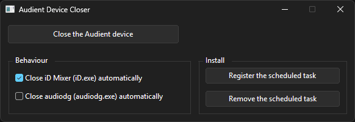

**EN** | [JP](README-jp.md)

# audient-device-closer

My Audient iD14mkII sometimes fails to come back properly after resuming from sleep on Windows.  
It doesn't happen every time, but it occurs fairly often.

After digging into it, I found the cause: applications such as iD Mixer keep holding the device internally across sleep and cannot restart it properly when the machine resumes.  
Unfortunately, [the official guidance is completely wrong](https://support.audient.com/hc/en-us/articles/360030879291-Interface-Frequently-Disconnects-On-Windows), so real help doesn't seem likely.

So I made a workaround tool called `audient-device-closer`.  
There is no guarantee that this fix works in every environment, but since I built this tool, the trouble has disappeared on my machine.

## Tested environment

- Windows 11 Home 26H2
- Audient iD14mkII

It may work with other devices too, but I don't own any, so that is untested.  
Note that this tool performs privileged operations such as closing devices, so it cannot be started with normal user privileges.  
If you don't trust it, please review the source code and build it yourself, or use it as a reference to write your own tool.

## Getting Started

Rather than installing it right away, first make sure the tool actually helps in your environment.

1. Reproduce the situation where no sound comes out after resuming from sleep.
2. Start this tool.
3. Press the `Close the Audient device` button.
4. If the device comes back normally, the tool is working as intended.
5. Press the `Register the scheduled task` button so that the fix is applied automatically after resuming from sleep.

## Usage

When you start the program normally, a window like this appears.



### The `Close the Audient device` button

Pressing this button closes the device that is stuck in a bad state.
Pressing it when no problem is occurring will most likely fail.

### Behaviour

#### Close iD Mixer (iD.exe) automatically

With this checked, iD Mixer is closed automatically when it is holding the device.

#### Close audiodg (audiodg.exe) automatically

With this checked, audiodg is closed automatically when it is holding the device.  
However, this process may also be holding other audio devices, so this option is generally not recommended.

### Install

Installation uses the current location of the exe file.  
If you delete or move the file afterwards, the tool will stop working properly.

#### Register the scheduled task

Registers the program so that it runs automatically after the computer resumes from sleep.

#### Remove the scheduled task

Removes the entry that was installed.

## How it works

A rough outline of what this tool actually does:

1. If started from Task Scheduler, wait 5 seconds; if started manually, don't wait
2. Check whether the device is connected via USB but not recognized as an audio device; if everything looks fine, exit
3. If a problem is found, try closing the device; if that succeeds, exit
4. If the failure was caused by `iD.exe` and the option is enabled, force it to quit (it is launched again from `AudientAppLauncher.exe` when the device reconnects, so this is safe; enabled by default)
5. If the failure was caused by `audiodg.exe` and the option is enabled, force it to quit (it comes back automatically via `Audiosrv`, but this affects other audio devices too, so it is disabled by default)
6. Try closing the device once more; if that succeeds, exit
7. If it still fails, show a list of the applications that caused the problem

## Credits

audient-device-closer is made possible by the following open source softwares.

### [Acutest](https://github.com/mity/acutest)

<details>
<summary>The MIT License</summary>

```
The MIT License (MIT)

Copyright © 2013-2019 Martin Mitáš

Permission is hereby granted, free of charge, to any person obtaining a
copy of this software and associated documentation files (the “Software”),
to deal in the Software without restriction, including without limitation
the rights to use, copy, modify, merge, publish, distribute, sublicense,
and/or sell copies of the Software, and to permit persons to whom the
Software is furnished to do so, subject to the following conditions:

The above copyright notice and this permission notice shall be included
in all copies or substantial portions of the Software.

THE SOFTWARE IS PROVIDED “AS IS”, WITHOUT WARRANTY OF ANY KIND, EXPRESS
OR IMPLIED, INCLUDING BUT NOT LIMITED TO THE WARRANTIES OF MERCHANTABILITY,
FITNESS FOR A PARTICULAR PURPOSE AND NONINFRINGEMENT. IN NO EVENT SHALL
THE AUTHORS OR COPYRIGHT HOLDERS BE LIABLE FOR ANY CLAIM, DAMAGES OR OTHER
LIABILITY, WHETHER IN AN ACTION OF CONTRACT, TORT OR OTHERWISE, ARISING
FROM, OUT OF OR IN CONNECTION WITH THE SOFTWARE OR THE USE OR OTHER DEALINGS
IN THE SOFTWARE.
```
</details>

### [hashmap.c](https://github.com/tidwall/hashmap.c)

> [!NOTE]
> This program/library used [a modified version of hashmap.c](https://github.com/oov/hashmap.c/tree/simplify).

<details>
<summary>The MIT License (MIT)</summary>

```
The MIT License (MIT)

Copyright (c) 2020 Joshua J Baker

Permission is hereby granted, free of charge, to any person obtaining a copy of
this software and associated documentation files (the "Software"), to deal in
the Software without restriction, including without limitation the rights to
use, copy, modify, merge, publish, distribute, sublicense, and/or sell copies of
the Software, and to permit persons to whom the Software is furnished to do so,
subject to the following conditions:

The above copyright notice and this permission notice shall be included in all
copies or substantial portions of the Software.

THE SOFTWARE IS PROVIDED "AS IS", WITHOUT WARRANTY OF ANY KIND, EXPRESS OR
IMPLIED, INCLUDING BUT NOT LIMITED TO THE WARRANTIES OF MERCHANTABILITY, FITNESS
FOR A PARTICULAR PURPOSE AND NONINFRINGEMENT. IN NO EVENT SHALL THE AUTHORS OR
COPYRIGHT HOLDERS BE LIABLE FOR ANY CLAIM, DAMAGES OR OTHER LIABILITY, WHETHER
IN AN ACTION OF CONTRACT, TORT OR OTHERWISE, ARISING FROM, OUT OF OR IN
CONNECTION WITH THE SOFTWARE OR THE USE OR OTHER DEALINGS IN THE SOFTWARE.
```
</details>

### [Mingw-w64](https://github.com/mingw-w64/mingw-w64)

> [!NOTE]
> The following license applies when the software is built with the MinGW-w64 runtime.

<details>
<summary>MinGW-w64 runtime licensing</summary>

```
MinGW-w64 runtime licensing
***************************

This program or library was built using MinGW-w64 and statically
linked against the MinGW-w64 runtime. Some parts of the runtime
are under licenses which require that the copyright and license
notices are included when distributing the code in binary form.
These notices are listed below.


========================
Overall copyright notice
========================

Copyright (c) 2009, 2010, 2011, 2012, 2013 by the mingw-w64 project

This license has been certified as open source. It has also been designated
as GPL compatible by the Free Software Foundation (FSF).

Redistribution and use in source and binary forms, with or without
modification, are permitted provided that the following conditions are met:

   1. Redistributions in source code must retain the accompanying copyright
      notice, this list of conditions, and the following disclaimer.
   2. Redistributions in binary form must reproduce the accompanying
      copyright notice, this list of conditions, and the following disclaimer
      in the documentation and/or other materials provided with the
      distribution.
   3. Names of the copyright holders must not be used to endorse or promote
      products derived from this software without prior written permission
      from the copyright holders.
   4. The right to distribute this software or to use it for any purpose does
      not give you the right to use Servicemarks (sm) or Trademarks (tm) of
      the copyright holders.  Use of them is covered by separate agreement
      with the copyright holders.
   5. If any files are modified, you must cause the modified files to carry
      prominent notices stating that you changed the files and the date of
      any change.

Disclaimer

THIS SOFTWARE IS PROVIDED BY THE COPYRIGHT HOLDERS ``AS IS'' AND ANY EXPRESSED
OR IMPLIED WARRANTIES, INCLUDING, BUT NOT LIMITED TO, THE IMPLIED WARRANTIES
OF MERCHANTABILITY AND FITNESS FOR A PARTICULAR PURPOSE ARE DISCLAIMED. IN NO
EVENT SHALL THE COPYRIGHT HOLDERS BE LIABLE FOR ANY DIRECT, INDIRECT,
INCIDENTAL, SPECIAL, EXEMPLARY, OR CONSEQUENTIAL DAMAGES (INCLUDING, BUT NOT
LIMITED TO, PROCUREMENT OF SUBSTITUTE GOODS OR SERVICES; LOSS OF USE, DATA,
OR PROFITS; OR BUSINESS INTERRUPTION) HOWEVER CAUSED AND ON ANY THEORY OF
LIABILITY, WHETHER IN CONTRACT, STRICT LIABILITY, OR TORT (INCLUDING
NEGLIGENCE OR OTHERWISE) ARISING IN ANY WAY OUT OF THE USE OF THIS SOFTWARE,
EVEN IF ADVISED OF THE POSSIBILITY OF SUCH DAMAGE.

========================================
getopt, getopt_long, and getop_long_only
========================================

Copyright (c) 2002 Todd C. Miller <Todd.Miller@courtesan.com>

Permission to use, copy, modify, and distribute this software for any
purpose with or without fee is hereby granted, provided that the above
copyright notice and this permission notice appear in all copies.

THE SOFTWARE IS PROVIDED "AS IS" AND THE AUTHOR DISCLAIMS ALL WARRANTIES
WITH REGARD TO THIS SOFTWARE INCLUDING ALL IMPLIED WARRANTIES OF
MERCHANTABILITY AND FITNESS. IN NO EVENT SHALL THE AUTHOR BE LIABLE FOR
ANY SPECIAL, DIRECT, INDIRECT, OR CONSEQUENTIAL DAMAGES OR ANY DAMAGES
WHATSOEVER RESULTING FROM LOSS OF USE, DATA OR PROFITS, WHETHER IN AN
ACTION OF CONTRACT, NEGLIGENCE OR OTHER TORTIOUS ACTION, ARISING OUT OF
OR IN CONNECTION WITH THE USE OR PERFORMANCE OF THIS SOFTWARE.

Sponsored in part by the Defense Advanced Research Projects
Agency (DARPA) and Air Force Research Laboratory, Air Force
Materiel Command, USAF, under agreement number F39502-99-1-0512.

        *       *       *       *       *       *       *

Copyright (c) 2000 The NetBSD Foundation, Inc.
All rights reserved.

This code is derived from software contributed to The NetBSD Foundation
by Dieter Baron and Thomas Klausner.

Redistribution and use in source and binary forms, with or without
modification, are permitted provided that the following conditions
are met:
 1. Redistributions of source code must retain the above copyright
    notice, this list of conditions and the following disclaimer.
 2. Redistributions in binary form must reproduce the above copyright
    notice, this list of conditions and the following disclaimer in the
    documentation and/or other materials provided with the distribution.

THIS SOFTWARE IS PROVIDED BY THE NETBSD FOUNDATION, INC. AND CONTRIBUTORS
``AS IS'' AND ANY EXPRESS OR IMPLIED WARRANTIES, INCLUDING, BUT NOT LIMITED
TO, THE IMPLIED WARRANTIES OF MERCHANTABILITY AND FITNESS FOR A PARTICULAR
PURPOSE ARE DISCLAIMED.  IN NO EVENT SHALL THE FOUNDATION OR CONTRIBUTORS
BE LIABLE FOR ANY DIRECT, INDIRECT, INCIDENTAL, SPECIAL, EXEMPLARY, OR
CONSEQUENTIAL DAMAGES (INCLUDING, BUT NOT LIMITED TO, PROCUREMENT OF
SUBSTITUTE GOODS OR SERVICES; LOSS OF USE, DATA, OR PROFITS; OR BUSINESS
INTERRUPTION) HOWEVER CAUSED AND ON ANY THEORY OF LIABILITY, WHETHER IN
CONTRACT, STRICT LIABILITY, OR TORT (INCLUDING NEGLIGENCE OR OTHERWISE)
ARISING IN ANY WAY OUT OF THE USE OF THIS SOFTWARE, EVEN IF ADVISED OF THE
POSSIBILITY OF SUCH DAMAGE.


===============================================================
gdtoa: Converting between IEEE floating point numbers and ASCII
===============================================================

The author of this software is David M. Gay.

Copyright (C) 1997, 1998, 1999, 2000, 2001 by Lucent Technologies
All Rights Reserved

Permission to use, copy, modify, and distribute this software and
its documentation for any purpose and without fee is hereby
granted, provided that the above copyright notice appear in all
copies and that both that the copyright notice and this
permission notice and warranty disclaimer appear in supporting
documentation, and that the name of Lucent or any of its entities
not be used in advertising or publicity pertaining to
distribution of the software without specific, written prior
permission.

LUCENT DISCLAIMS ALL WARRANTIES WITH REGARD TO THIS SOFTWARE,
INCLUDING ALL IMPLIED WARRANTIES OF MERCHANTABILITY AND FITNESS.
IN NO EVENT SHALL LUCENT OR ANY OF ITS ENTITIES BE LIABLE FOR ANY
SPECIAL, INDIRECT OR CONSEQUENTIAL DAMAGES OR ANY DAMAGES
WHATSOEVER RESULTING FROM LOSS OF USE, DATA OR PROFITS, WHETHER
IN AN ACTION OF CONTRACT, NEGLIGENCE OR OTHER TORTIOUS ACTION,
ARISING OUT OF OR IN CONNECTION WITH THE USE OR PERFORMANCE OF
THIS SOFTWARE.

        *       *       *       *       *       *       *

The author of this software is David M. Gay.

Copyright (C) 2005 by David M. Gay
All Rights Reserved

Permission to use, copy, modify, and distribute this software and its
documentation for any purpose and without fee is hereby granted,
provided that the above copyright notice appear in all copies and that
both that the copyright notice and this permission notice and warranty
disclaimer appear in supporting documentation, and that the name of
the author or any of his current or former employers not be used in
advertising or publicity pertaining to distribution of the software
without specific, written prior permission.

THE AUTHOR DISCLAIMS ALL WARRANTIES WITH REGARD TO THIS SOFTWARE,
INCLUDING ALL IMPLIED WARRANTIES OF MERCHANTABILITY AND FITNESS.  IN
NO EVENT SHALL THE AUTHOR OR ANY OF HIS CURRENT OR FORMER EMPLOYERS BE
LIABLE FOR ANY SPECIAL, INDIRECT OR CONSEQUENTIAL DAMAGES OR ANY
DAMAGES WHATSOEVER RESULTING FROM LOSS OF USE, DATA OR PROFITS,
WHETHER IN AN ACTION OF CONTRACT, NEGLIGENCE OR OTHER TORTIOUS ACTION,
ARISING OUT OF OR IN CONNECTION WITH THE USE OR PERFORMANCE OF THIS
SOFTWARE.

        *       *       *       *       *       *       *

The author of this software is David M. Gay.

Copyright (C) 2004 by David M. Gay.
All Rights Reserved
Based on material in the rest of /netlib/fp/gdota.tar.gz,
which is copyright (C) 1998, 2000 by Lucent Technologies.

Permission to use, copy, modify, and distribute this software and
its documentation for any purpose and without fee is hereby
granted, provided that the above copyright notice appear in all
copies and that both that the copyright notice and this
permission notice and warranty disclaimer appear in supporting
documentation, and that the name of Lucent or any of its entities
not be used in advertising or publicity pertaining to
distribution of the software without specific, written prior
permission.

LUCENT DISCLAIMS ALL WARRANTIES WITH REGARD TO THIS SOFTWARE,
INCLUDING ALL IMPLIED WARRANTIES OF MERCHANTABILITY AND FITNESS.
IN NO EVENT SHALL LUCENT OR ANY OF ITS ENTITIES BE LIABLE FOR ANY
SPECIAL, INDIRECT OR CONSEQUENTIAL DAMAGES OR ANY DAMAGES
WHATSOEVER RESULTING FROM LOSS OF USE, DATA OR PROFITS, WHETHER
IN AN ACTION OF CONTRACT, NEGLIGENCE OR OTHER TORTIOUS ACTION,
ARISING OUT OF OR IN CONNECTION WITH THE USE OR PERFORMANCE OF
THIS SOFTWARE.


=========================
Parts of the math library
=========================

Copyright (C) 1993 by Sun Microsystems, Inc. All rights reserved.

Developed at SunSoft, a Sun Microsystems, Inc. business.
Permission to use, copy, modify, and distribute this
software is freely granted, provided that this notice
is preserved.

        *       *       *       *       *       *       *

Copyright (C) 1993 by Sun Microsystems, Inc. All rights reserved.

Developed at SunPro, a Sun Microsystems, Inc. business.
Permission to use, copy, modify, and distribute this
software is freely granted, provided that this notice
is preserved.

        *       *       *       *       *       *       *

FIXME: Cephes math lib
Copyright (C) 1984-1998 Stephen L. Moshier

It sounds vague, but as to be found at
<http://lists.debian.org/debian-legal/2004/12/msg00295.html>, it gives an
impression that the author could be willing to give an explicit
permission to distribute those files e.g. under a BSD style license. So
probably there is no problem here, although it could be good to get a
permission from the author and then add a license into the Cephes files
in MinGW runtime. At least on follow-up it is marked that debian sees the
version a-like BSD one. As MinGW.org (where those cephes parts are coming
from) distributes them now over 6 years, it should be fine.

===================================
Headers and IDLs imported from Wine
===================================

Some header and IDL files were imported from the Wine project. These files
are prominent maked in source. Their copyright belongs to contributors and
they are distributed under LGPL license.

Disclaimer

This library is free software; you can redistribute it and/or
modify it under the terms of the GNU Lesser General Public
License as published by the Free Software Foundation; either
version 2.1 of the License, or (at your option) any later version.

This library is distributed in the hope that it will be useful,
but WITHOUT ANY WARRANTY; without even the implied warranty of
MERCHANTABILITY or FITNESS FOR A PARTICULAR PURPOSE.  See the GNU
Lesser General Public License for more details.
```
</details>

### [nanoprintf](https://github.com/charlesnicholson/nanoprintf)

> [!NOTE]
> This program/library used [a modified version of nanoprintf](https://github.com/oov/nanoprintf/tree/custom).

<details>
<summary>UNLICENSE</summary>

```
This is free and unencumbered software released into the public domain.

Anyone is free to copy, modify, publish, use, compile, sell, or
distribute this software, either in source code form or as a compiled
binary, for any purpose, commercial or non-commercial, and by any
means.

In jurisdictions that recognize copyright laws, the author or authors
of this software dedicate any and all copyright interest in the
software to the public domain. We make this dedication for the benefit
of the public at large and to the detriment of our heirs and
successors. We intend this dedication to be an overt act of
relinquishment in perpetuity of all present and future rights to this
software under copyright law.

THE SOFTWARE IS PROVIDED "AS IS", WITHOUT WARRANTY OF ANY KIND,
EXPRESS OR IMPLIED, INCLUDING BUT NOT LIMITED TO THE WARRANTIES OF
MERCHANTABILITY, FITNESS FOR A PARTICULAR PURPOSE AND NONINFRINGEMENT.
IN NO EVENT SHALL THE AUTHORS BE LIABLE FOR ANY CLAIM, DAMAGES OR
OTHER LIABILITY, WHETHER IN AN ACTION OF CONTRACT, TORT OR OTHERWISE,
ARISING FROM, OUT OF OR IN CONNECTION WITH THE SOFTWARE OR THE USE OR
OTHER DEALINGS IN THE SOFTWARE.

For more information, please refer to <http://unlicense.org>
```
</details>

### [ovbase](https://github.com/oov/ovbase)

<details>
<summary>The MIT License (MIT)</summary>

```
The MIT License (MIT)

Copyright (c) 2021 oov

Permission is hereby granted, free of charge, to any person obtaining a copy of
this software and associated documentation files (the "Software"), to deal in
the Software without restriction, including without limitation the rights to
use, copy, modify, merge, publish, distribute, sublicense, and/or sell copies of
the Software, and to permit persons to whom the Software is furnished to do so,
subject to the following conditions:

The above copyright notice and this permission notice shall be included in all
copies or substantial portions of the Software.

THE SOFTWARE IS PROVIDED "AS IS", WITHOUT WARRANTY OF ANY KIND, EXPRESS OR
IMPLIED, INCLUDING BUT NOT LIMITED TO THE WARRANTIES OF MERCHANTABILITY, FITNESS
FOR A PARTICULAR PURPOSE AND NONINFRINGEMENT. IN NO EVENT SHALL THE AUTHORS OR
COPYRIGHT HOLDERS BE LIABLE FOR ANY CLAIM, DAMAGES OR OTHER LIABILITY, WHETHER
IN AN ACTION OF CONTRACT, TORT OR OTHERWISE, ARISING FROM, OUT OF OR IN
CONNECTION WITH THE SOFTWARE OR THE USE OR OTHER DEALINGS IN THE SOFTWARE.
```
</details>

### [SipHash](https://github.com/veorq/SipHash)

> [!NOTE]
> This program/library includes [an implementation adapted from SipHash](https://github.com/oov/ovbase/blob/main/src/hashmap/common.c).

<details>
<summary>CC0 Public Domain</summary>

```
SipHash reference C implementation

Copyright (c) 2012-2016 Jean-Philippe Aumasson
<jeanphilippe.aumasson@gmail.com>
Copyright (c) 2012-2014 Daniel J. Bernstein <djb@cr.yp.to>

To the extent possible under law, the author(s) have dedicated all copyright
and related and neighboring rights to this software to the public domain
worldwide. This software is distributed without any warranty.

You should have received a copy of the CC0 Public Domain Dedication along
with this software. If not, see
<http://creativecommons.org/publicdomain/zero/1.0/>.
```
</details>

### [SplitMix](https://xoshiro.di.unimi.it/splitmix64.c)

> [!NOTE]
> This program/library includes [an implementation adapted from SplitMix](https://github.com/oov/ovbase/blob/main/include/ovrand.h).

<details>
<summary>Public Domain</summary>

```
SplitMix64

Copyright 2015 Sebastiano Vigna. Public Domain.
```
</details>

<details>
<summary>Unlicense</summary>

```
SplitMix32

This is free and unencumbered software released into the public domain.

Anyone is free to copy, modify, publish, use, compile, sell, or
distribute this software, either in source code form or as a compiled
binary, for any purpose, commercial or non-commercial, and by any
means.

In jurisdictions that recognize copyright laws, the author or authors
of this software dedicate any and all copyright interest in the
software to the public domain. We make this dedication for the benefit
of the public at large and to the detriment of our heirs and
successors. We intend this dedication to be an overt act of
relinquishment in perpetuity of all present and future rights to this
software under copyright law.

THE SOFTWARE IS PROVIDED "AS IS", WITHOUT WARRANTY OF ANY KIND,
EXPRESS OR IMPLIED, INCLUDING BUT NOT LIMITED TO THE WARRANTIES OF
MERCHANTABILITY, FITNESS FOR A PARTICULAR PURPOSE AND NONINFRINGEMENT.
IN NO EVENT SHALL THE AUTHORS BE LIABLE FOR ANY CLAIM, DAMAGES OR
OTHER LIABILITY, WHETHER IN AN ACTION OF CONTRACT, TORT OR OTHERWISE,
ARISING FROM, OUT OF OR IN CONNECTION WITH THE SOFTWARE OR THE USE OR
OTHER DEALINGS IN THE SOFTWARE.

For more information, please refer to <http://unlicense.org/>
```
</details>

### [TinyCThread](https://github.com/tinycthread/tinycthread)

> [!NOTE]
> This program/library used [a modified version of TinyCThread](https://github.com/oov/tinycthread).

<details>
<summary>The zlib/libpng License</summary>

```
Copyright (c) 2012 Marcus Geelnard
              2013-2016 Evan Nemerson

This software is provided 'as-is', without any express or implied
warranty. In no event will the authors be held liable for any damages
arising from the use of this software.

Permission is granted to anyone to use this software for any purpose,
including commercial applications, and to alter it and redistribute it
freely, subject to the following restrictions:

    1. The origin of this software must not be misrepresented; you must not
    claim that you wrote the original software. If you use this software
    in a product, an acknowledgment in the product documentation would be
    appreciated but is not required.

    2. Altered source versions must be plainly marked as such, and must not be
    misrepresented as being the original software.

    3. This notice may not be removed or altered from any source
    distribution.
```
</details>

### [yyjson](https://github.com/ibireme/yyjson)

<details>
<summary>MIT License</summary>

```
MIT License

Copyright (c) 2020 YaoYuan <ibireme@gmail.com>

Permission is hereby granted, free of charge, to any person obtaining a copy
of this software and associated documentation files (the "Software"), to deal
in the Software without restriction, including without limitation the rights
to use, copy, modify, merge, publish, distribute, sublicense, and/or sell
copies of the Software, and to permit persons to whom the Software is
furnished to do so, subject to the following conditions:

The above copyright notice and this permission notice shall be included in all
copies or substantial portions of the Software.

THE SOFTWARE IS PROVIDED "AS IS", WITHOUT WARRANTY OF ANY KIND, EXPRESS OR
IMPLIED, INCLUDING BUT NOT LIMITED TO THE WARRANTIES OF MERCHANTABILITY,
FITNESS FOR A PARTICULAR PURPOSE AND NONINFRINGEMENT. IN NO EVENT SHALL THE
AUTHORS OR COPYRIGHT HOLDERS BE LIABLE FOR ANY CLAIM, DAMAGES OR OTHER
LIABILITY, WHETHER IN AN ACTION OF CONTRACT, TORT OR OTHERWISE, ARISING FROM,
OUT OF OR IN CONNECTION WITH THE SOFTWARE OR THE USE OR OTHER DEALINGS IN THE
SOFTWARE.
```
</details>
